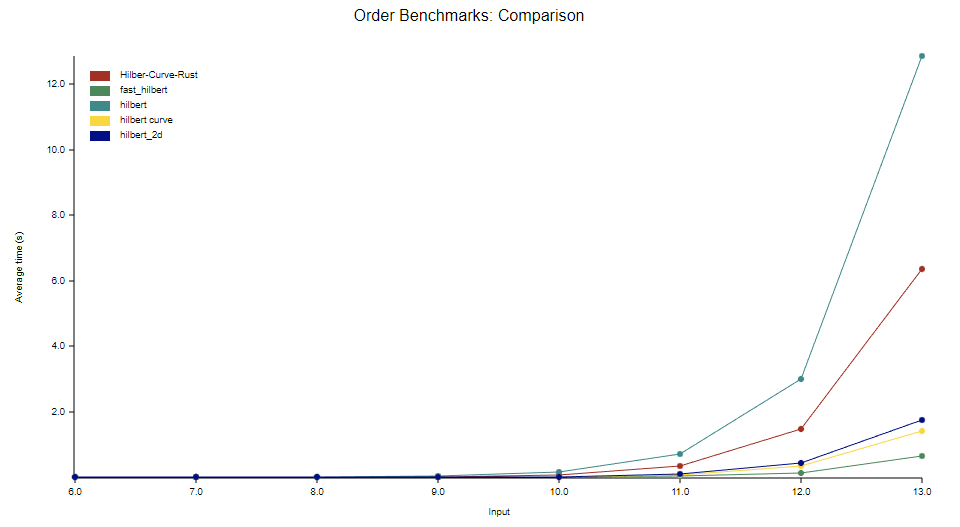

# Hilbert Curve Algorithm

[](https://github.com/MrDesjardins/hilbert-curve-rust)
[](https://github.com/MrDesjardins/hilbert-curve-rust/actions/workflows/rust.yml)
[](https://crates.io/crates/hilbert-curve-rust)
[](https://docs.rs/hilbert-curve-rust/latest/hilbert_curve_rust)
[](https://codecov.io/gh/MrDesjardins/hilbert-curve-rust)

Rust implentation of the Hilbert Curve algoritm. The library moves from point (x, y) to index (z) and index (z) to point (x, y).

# As a Consumer of the Library

## Install

```sh
cargo add hilbert-curve-rust
```

Detail on [Crate.io](https://crates.io/crates/hilbert-curve-rust)

## How to use?

The [Rust Documentation](https://docs.rs/hilbert-curve-rust/latest/hilbert_curve_rust) for the Hilbert Curve Rust library is available online. However, here are two examples to get started.

### Index to point

Single dimension integer into a two dimensionals coordinate

```rust
let hilbert_curve = HilbertCurveAlgorithm::new(1); // Set the Hilbert order here
let point = hilbert_curve.index_to_point(0); // Get the point for index 0
```

### Point to index

Two dimensionals coordinate into a single dimension integer.

```rust
let hilbert_curve = HilbertCurveAlgorithm::new(1);// Set the Hilbert order here
let index = hilbert_curve.point_to_index(CoordinateValue { x: 0, y: 0 }); // Get the index for (0,0) point
```

# As a Developer of the Hibert Curve Rust Library

If you want to contribute to the Hibert Curve Rust code base. Here are few informations that might be useful.

## Test and Coverage

### Coverage

You must install few components before running coverage:

```sh
cargo install grcov
rustup component add llvm-tools-preview
```

Then, you can run:

```sh
./coverage.sh
```

Further explanation in the [Mozilla grcov website](https://github.com/mozilla/grcov)

## Documentation

```sh
cargo doc --open
```

# Benchmark

```sh
cargo bench
```

## Publishing

```sh
cargo login
cargo publish --dry-run
cargo publish
```

# Performance Compared to other Rust Libraries

# Comparing on Order 8

The benchmark finds all index of each position (x,y) has an average time to scan all position

| Library                                                                  |      Mean |
| ------------------------------------------------------------------------ | --------: |
| [fast_hilbert](https://crates.io/crates/fast_hilbert)                    | 0.3364 ms |
| [hilbert_curve](https://crates.io/crates/hilbert_curve)                  | 0.7496 ms |
| [hilbert_2d](https://crates.io/crates/hilbert_2d)                        | 1.2898 ms |
| [hilbert-curve-rust](https://github.com/MrDesjardins/hilbert-curve-rust) | 4.0490 ms |
| [hilbert](https://crates.io/crates/hilbert)                              | 9.2606 ms |

# Comparing Each Framework on Multiple Orders

The test loops all x,y to find the index. Here are the average of each framework.


The plot shows that this current package start not performing as well as the [hilbert_2d](https://crates.io/crates/hilbert_2d) or the [fast_hilbert](https://crates.io/crates/fast_hilbert) above 10 orders. Meaning that if you need more than a grid of 1024 by 1024 (~1 million pixel) that this library starts to under perform. What is interesting is to see the [hilbert_curve](https://crates.io/crates/hilbert_curve) performing way better since this library is using the same algorithm implemented differently. Future improvement of this library will be applied as my knowledge of Rust improve.