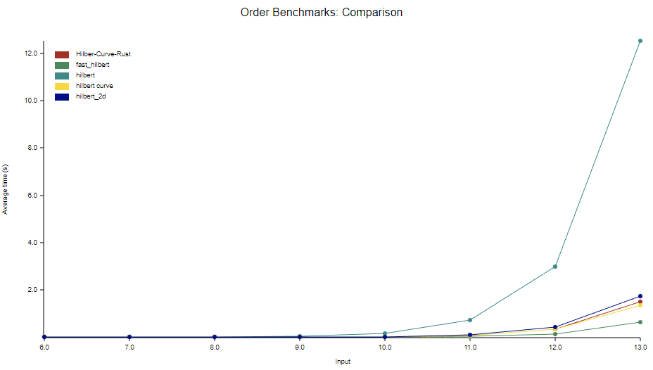

# Hilbert Curve Algorithm

[](https://github.com/MrDesjardins/hilbert-curve-rust)
[](https://github.com/MrDesjardins/hilbert-curve-rust/actions/workflows/rust.yml)
[](https://crates.io/crates/hilbert-curve-rust)
[](https://docs.rs/hilbert-curve-rust/latest/hilbert_curve_rust)
[](https://codecov.io/gh/MrDesjardins/hilbert-curve-rust)

Rust implentation of the Hilbert Curve algoritm. The library moves from point (x, y) to index (z) and index (z) to point (x, y).

# As a Consumer of the Library

## Install

```sh
cargo add hilbert-curve-rust
```

Detail on [Crate.io](https://crates.io/crates/hilbert-curve-rust)

## How to use?

The [Rust Documentation](https://docs.rs/hilbert-curve-rust/latest/hilbert_curve_rust) for the Hilbert Curve Rust library is available online. However, here are two examples to get started.

### Index to point

Single dimension integer into a two dimensionals coordinate

```rust
let hilbert_curve = HilbertCurveAlgorithm::new(1); // Set the Hilbert order here
let point = hilbert_curve.index_to_point(0); // Get the point for index 0
```

### Point to index

Two dimensionals coordinate into a single dimension integer.

```rust
let hilbert_curve = HilbertCurveAlgorithm::new(1);// Set the Hilbert order here
let index = hilbert_curve.point_to_index(CoordinateValue { x: 0, y: 0 }); // Get the index for (0,0) point
```

# As a Developer of the Hibert Curve Rust Library

If you want to contribute to the Hibert Curve Rust code base. Here are few informations that might be useful.

## Test and Coverage

### Coverage

You must install few components before running coverage:

```sh
cargo install grcov
rustup component add llvm-tools-preview
```

Then, you can run:

```sh
./coverage.sh
```

Further explanation in the [Mozilla grcov website](https://github.com/mozilla/grcov)

## Documentation

```sh
cargo doc --open
```

# Benchmark

```sh
./benchmark.sh
```

## Publishing

```sh
cargo login
cargo publish --dry-run
cargo publish
```

# Performance Compared to other Rust Libraries

## Comparing on Order 8

The benchmark finds all index of each position (x,y) has an average time to scan all position

| Library                                                                  |      Mean |
| ------------------------------------------------------------------------ | --------: |
| [fast_hilbert](https://crates.io/crates/fast_hilbert)                    | 0.3364 ms |
| [hilbert_curve](https://crates.io/crates/hilbert_curve)                  | 0.7496 ms |
| [hilbert-curve-rust](https://github.com/MrDesjardins/hilbert-curve-rust) | 1.0290 ms |
| [hilbert_2d](https://crates.io/crates/hilbert_2d)                        | 1.3298 ms |
| [hilbert](https://crates.io/crates/hilbert)                              | 9.9606 ms |

## Comparing Each Framework on Multiple Orders

The test loops all x, y coordinates to find the index. Here are the average of each framework.



The plot shows three clear groups. The worse algorithm is the [hilbert](https://crates.io/crates/hilbert), which goes exponentially worse after an order of `10`.

A second group that contains this library ([hilbert-curve-rust](https://github.com/MrDesjardins/hilbert-curve-rust)) where performance is more stable but starts to get worse around an order `12`.

The last group with one algorithm, the [fast_hilbert](https://crates.io/crates/fast_hilbert), is the clear fastest algorithm.

From some perspective, a grid of 1024 by 1024 (~1 million points/pixels) is good with any library. However, if you need to start having a grid of 8192 by 8192 (order 13, with 67 million points/pixels), then it might be better to use the [fast_hilbert](https://crates.io/crates/fast_hilbert). The plot shows the second group next to the best group, but the reality is that [fast_hilbert](https://crates.io/crates/fast_hilbert) can be 10x faster than the three next contenders.

# Performance Learning Experience

Reduced the benchmark by about 3 seconds by using reference instead of copying value in functions `update_rx_from_point`, `update_ry_from_point`, `update_point_value_from_number`, `move_point` and `rotate_point`.


The plot shows the previous benchmark in red and the change of using reference instead of immutable in blue. By removing the copy of objects and passing a reference, the program needs to create less memory and only change the value in specific memory. The gain was significant.

